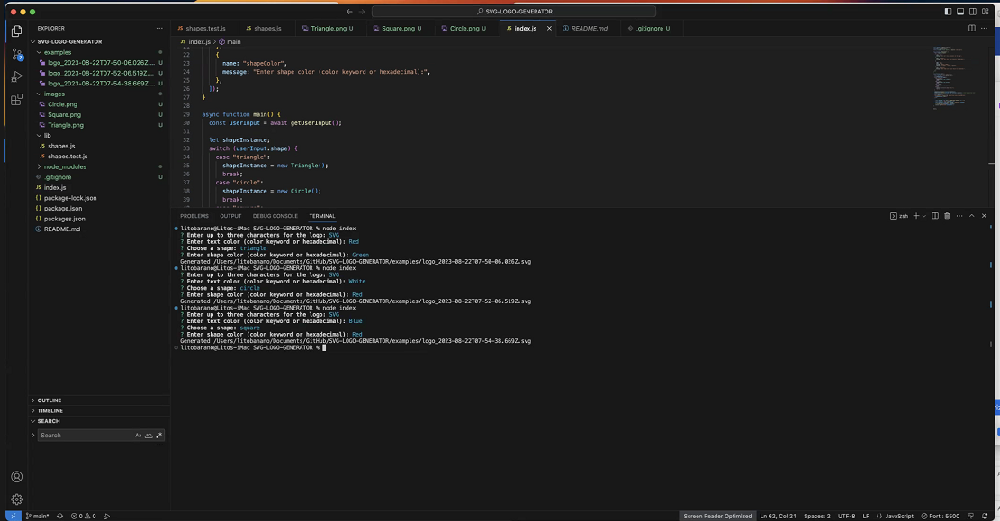
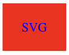
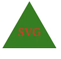

# SVG Logo Generator

Generate simple logos for your projects without the need for a graphic designer.

## Table of Contents
- [Description](#description)
- [Screenshots](#screenshots)
- [Installation](#installation)
- [Usage](#usage)
- [Walkthrough Video](#walkthrough-video)
- [Contributing](#contributing)
- [License](#license)

## Description

The SVG Logo Maker is a Node.js command-line application that allows you to generate logos with customizable text, shapes, and colors. It's a useful tool for freelance web developers who want to create logos for their projects without relying on a graphic designer.

## Screenshots






## Installation

1. Clone the repository:
   ```sh
   git clone https://github.com/hyperlitz/SVG-LOGO-GENERATOR.git
   cd SVG-LOGO-GENERATOR

2. Install the dependencies:
   npm install

## Usage

1. Run the application:
   node index.js

2. Follow the prompts to enter text, text color, shape, and shape color.

3. The application will generate an SVG logo and save it in the examples directory.


## Walkthrough Video

[Watch the Walkthrough Video](https://drive.google.com/file/d/1GV8AVIMRWiqK9MLVuyIkqC8p2FRyf42J/view)


## Contributing

Contributions are welcome! If you find a bug or have a suggestion, please create an issue or submit a pull request.

## License

his project is licensed under the MIT License - see the LICENSE file for details.

## Credits to owner:

- Lito Banano
- litobanano@yahoo.com
- Repository Link: [My Awesome Repository](https://github.com/hyperlitz/SVG-LOGO-GENERATOR)